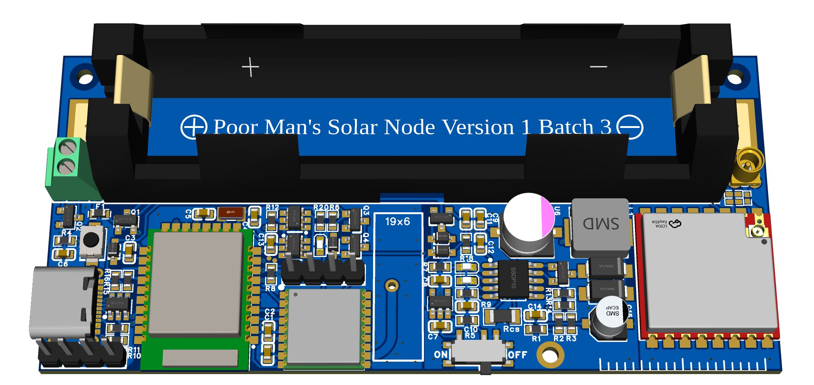
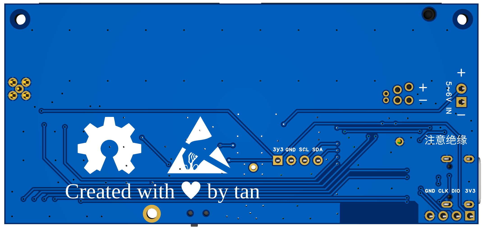
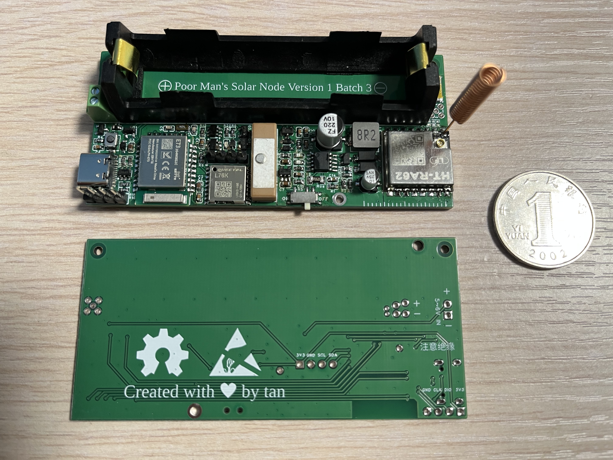
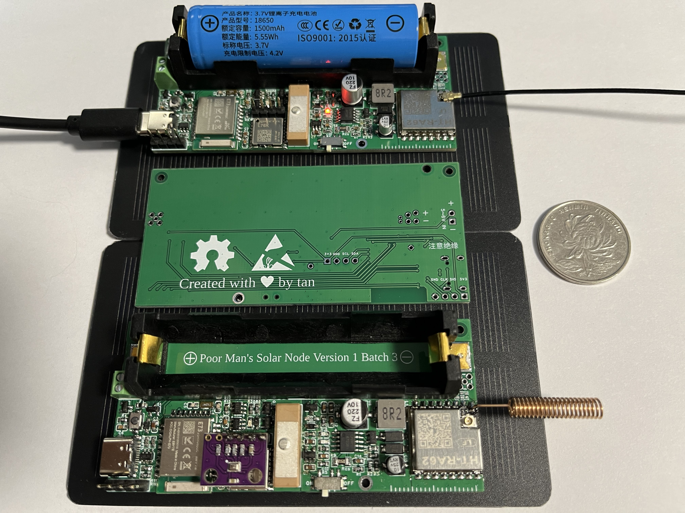

# Poor Man's Solar Node

A cheap, efficient, and fully functional solar-powered LoRa node.

> [!WARNING]  
> This project is under development and may undergo significant changes.

## Pictures

Click for more

## If you want to replicate it...

 - It's a double-layer PCB with a default thickness of 1.6 mm.
 - Diodes D6 and D7 can be removed as they are unnecessary. After removing D7, bridge its pads to maintain circuit continuity.
 - You can choose a Schottky diode with lower reverse current to replace D1.
 - Use a 5-6V solar panel. The currently selected LDO has a maximum withstand voltage of 6.5V.
 - Please note that older versions of the HT-RA62 may not be able to send 200-byte-long messages.

## License

GPL-3.0

Copyright (c) 2025, tan
